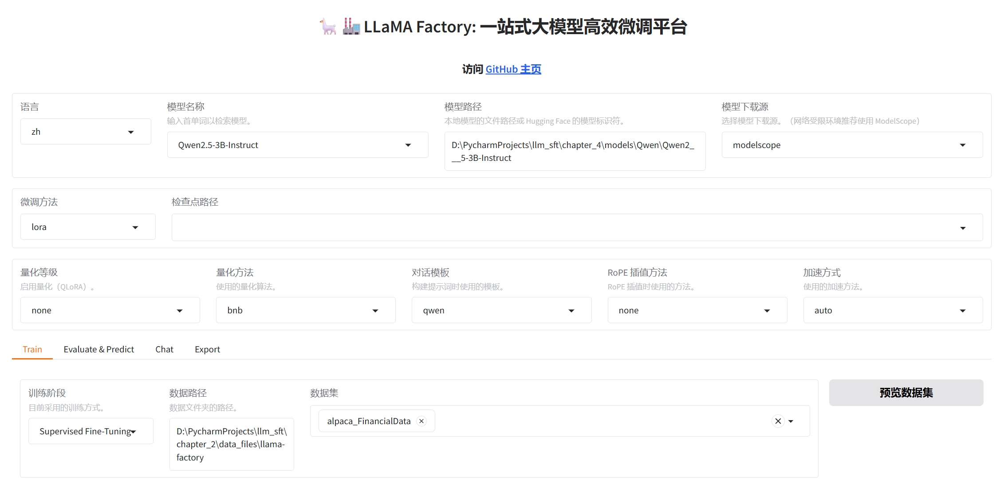
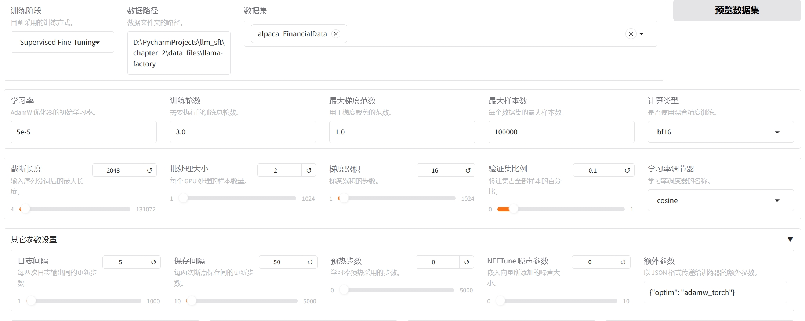
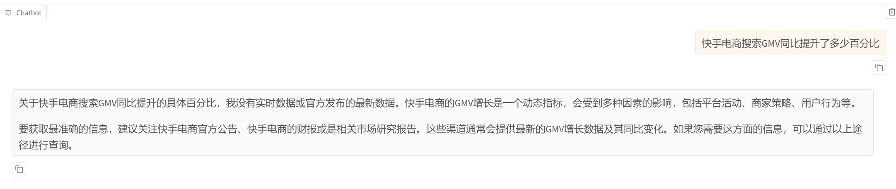
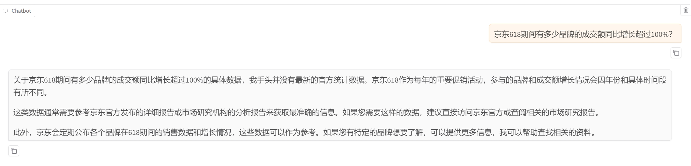
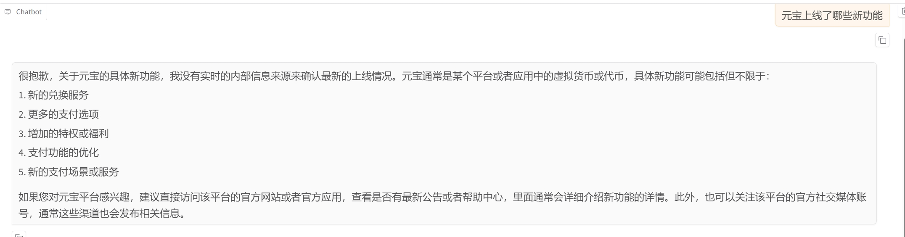
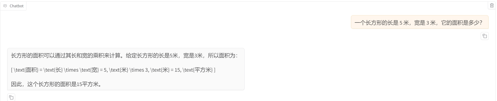
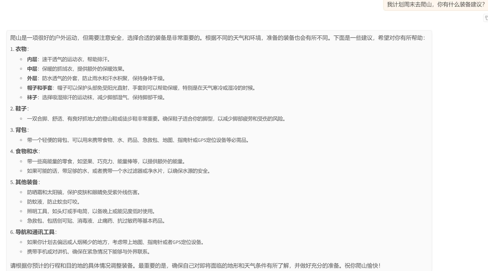
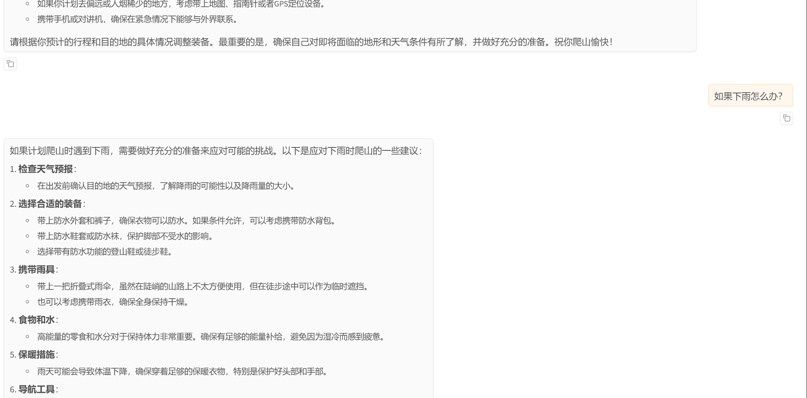

# Qwen2.5-3B-Instruct微调财报数据

- [参考文章](https://buaa-act.feishu.cn/wiki/KY9xwTGs1iqHrRkjXBwcZP9WnL9)
- [财报数据](https://github.com/llm-factory/FinancialData-SecondQuarter-2024)
- [模型](https://www.modelscope.cn/models/Qwen/Qwen2.5-3B-Instruct)
- [Swanlab](https://swanlab.cn/@YXY1109/qwen2.5_3b_financialdata/runs/9s3yz1wlqwynf1eskplta/chart)
- [Swanlab](https://swanlab.cn/@YXY1109/qwen2.5_3b_financialdata_identity/runs/4vdwx6jtpxj53ewqp8cvf/chart)

## LLaMA-Factory参数

## 测试问题

### 一，原始模型推理

- 问题1：快手电商搜索GMV同比提升了多少百分比
  
- 问题2：京东618期间有多少品牌的成交额同比增长超过100%？
  
- 问题3：元宝上线了哪些新功能
  
- 问题4：中国的首都是哪里？
  
- 问题5：一个长方形的长是 5 米，宽是 3 米，它的面积是多少？
  
- 问题6：我计划周末去爬山，你有什么装备建议？
  
    - 如果下雨怎么办？
      
